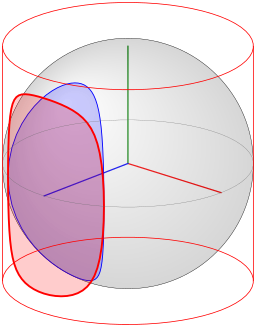
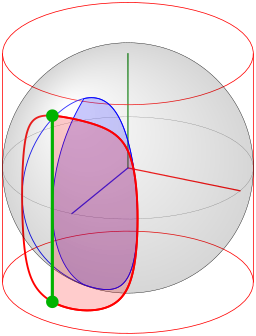
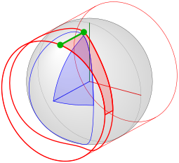

# svg-gen
C++ code to generate SVG files

Various classes for objects which can be written to a SVG file. Most of the classes are subclasses of `Polygon`, which is a sequence of 3D vertex positions. There are classes for spherical and cylindrical projections of arbitrary 3D polygons.

Once a polygon is created, it is projected to 2D by using a camera (parallel for now), and then written to a SVG. All polygon derived classes objects are written as a `path` element in the output SVG file.

There are various figures defined in `figures.cpp` file. A figure (see class `Figure`) is a set of objects. When a figure is written to a SVG, the full file is created, including header (with the bounding box), and all SVG elements. There are various figures already defined, tailored for a specific paper.

A makefile is provided, which outputs the svg figures (target `allsvgs`). The makefile can also convert SVG files to PNG or PDF, by using the application `rsvg-convert` (available in macOS).

## Sample image

Here are some sample images obtained with the code:

#### Figure 2

#### Figure 3

#### Figure 4

#### Figure 5

